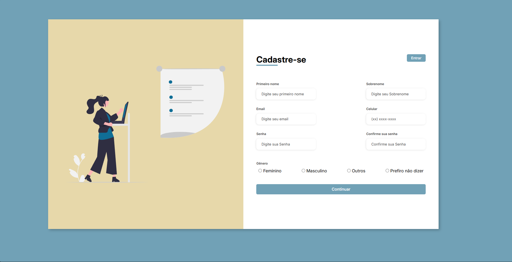
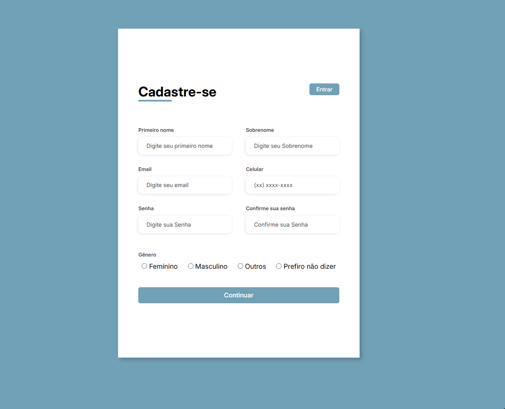
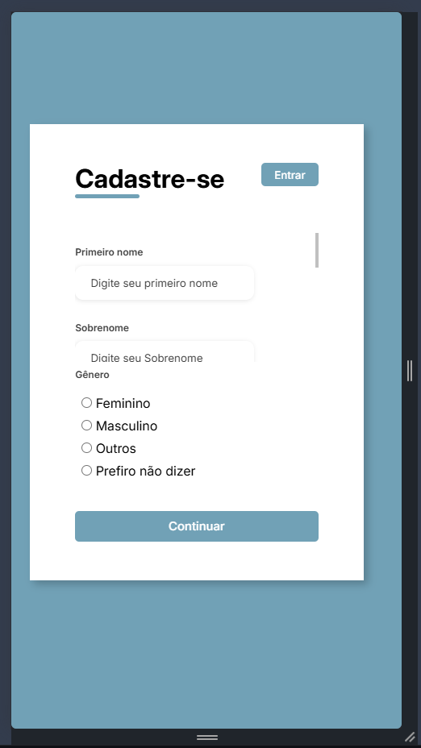

<div align="center">

# 📝 Formulário de Cadastro Responsivo

Um formulário de cadastro completo e responsivo, com ilustração e validação nativa de campos, construído com HTML e CSS puros.


[🔗 Ver Demo](https://formulario-responsivo-mu.vercel.app)
</div>

---

## 📌 Sobre o Projeto

Este projeto é um formulário de cadastro com foco em **responsividade e organização de campos**, criado para praticar fundamentos de front-end: estruturação de formulários extensos, uso de diferentes tipos de input (texto, email, telefone, senha, radio) e layout com imagem ilustrativa ao lado do conteúdo. A proposta não envolve envio real dos dados — é um formulário estático, sem back-end — e sim um exercício de construção de interface limpa e funcional.

## 🖼️ Demonstração

<div align="center">

<table>
  <tr>
    <td align="center">
      <b>Desk</b><br>
      
    </td>
    <td align="center" rowspan="2">
      <b>Tablet</b><br>
      
    </td>
  </tr>
  <tr>
    <td align="center">
      <b>Mobile</b><br>
      
    </td>
  </tr>
</table>

</div>

> 💡 Acesse a [demo ao vivo](https://formulario-responsivo-mu.vercel.app) para testar você mesmo.

## ✨ Funcionalidades

- 📝 Campos de Primeiro nome, Sobrenome, Email, Celular, Senha e Confirmar senha
- ✅ Validação nativa de campos obrigatórios e de formato (email, telefone)
- ⚧️ Seleção de gênero (Feminino, Masculino, Outros, Prefiro não dizer)
- 🖼️ Ilustração ao lado do formulário
- 📱 Layout responsivo (desktop, tablet e mobile)

## 🛠️ Tecnologias

| Tecnologia | Uso |
|---|---|
|  | Estrutura da página |
|  | Estilização e responsividade |

## 🚀 Como Executar

```bash
# Clone o repositório
git clone https://github.com/Geandysson/Formulario-Responsivo.git

# Acesse a pasta do projeto
cd Formulario-Responsivo

# Abra o index.html no navegador
# (ou use a extensão Live Server no VS Code)
```

Não há dependências para instalar é um projeto 100% front-end estático, sem bibliotecas externas.

## 📂 Estrutura do Projeto

```
Formulario-Responsivo/
├── assets/
│   ├── css/
│   │   └── style.css                          # Estilos e responsividade
│   └── img/
│       ├── icone.png                            # Favicon
│       └── undraw_conference_3n82.svg  # Ilustração do formulário
├── index.html                                    # Estrutura principal da página
```

## 🎯 Aprendizados

- Estruturação de formulários extensos com múltiplos tipos de input
- Uso de `label` associado a `input` para acessibilidade
- Organização de layout em duas colunas (ilustração + formulário)
- Boas práticas de responsividade com CSS
- Organização de projeto front-end simples e escalável

## 👤 Autor

**Geandysson**

[](https://github.com/Geandysson)

---